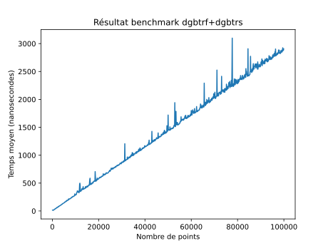
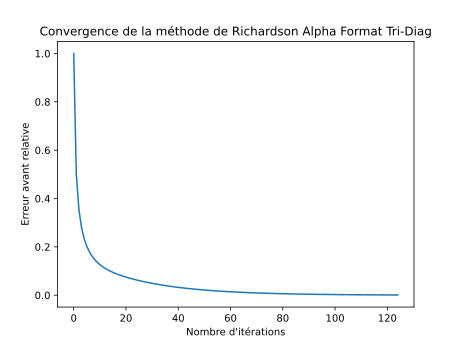
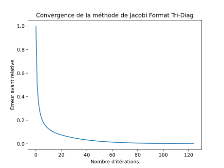
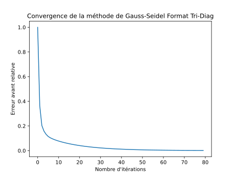
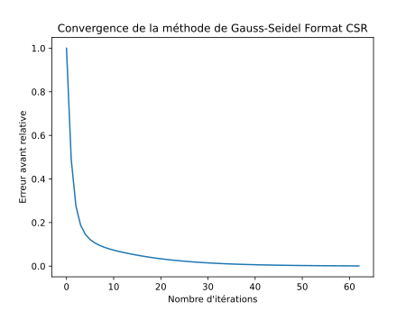

TODO: Ne pas oublier d'enlever ca
[TP_Poisson]$ docker build -t tppoisson -f docker/Dockerfile .
[TP_Poisson]$ docker run -it -v $PWD:/tp tppoisson
root@container:/app# cd /tp

# Projet de Calcul Numérique : TP Poisson 1D

## 0 : Introduction

Ce TP a pour but de résoudre le problème de l'équation de la chaleur stationnaire par méthodes directes et itératives, et de comparer les performances, précision et complexité des différentes méthodes.
Nous faisons cela en C en utilisant les bibliothèques BLAS et LAPACK.

Dans ce rapport nous allons dans un premier temps étudier l'équation de la chaleur, nous allons la transformer afin de pouvoir la traiter numériquement.

Ensuite, nous discuterons du format de stockage bande, et des matrices tri-diagonales.
Nous en profiterons pour nous nous familiariser avec les fonctions de BLAS et LAPACK.


Enfin, nous allons étudier les méthodes directes et itératives pour résoudre le problème de Poisson 1D.
Avec les méthodes directes, nous utiliserons des fonctions de résolution de systèmes linéaires comme la factorisation LU, descente et remontée, et avec les méthodes itératives, nous utiliserons des méthodes de résolution de systèmes linéaires itératives comme Richardson, Jacobi et Gauss-Seidel.
Nous comparerons les performances, précision et complexité des différentes méthodes.

Enfin, nous explorerons d'autres formats de stockage de matrices creuses, comme le format CSR et CSC, et nous implémenterons les méthodes directes et itératives avec ces formats.

## 1 : Travail préliminaire : Étude de l'équation de la chaleur

Nous travaillons avec l'équation de la chaleur en 1D, dans un milieu immobile, linéaire, et homogène, avec des termes sources et isotropes.

L'équation de la chaleur peut se poser sous la forme d'un système d'équations différentielles partielles, avec des conditions aux bords, ici les conditions de Dirichlet.

$$
\begin{cases}
	-k \frac{\delta ^2T}{\delta x^2} = g, x \in ]0, 1[ \\
	T(0) = T_0 \\
	T(1) = T_1
\end{cases}
$$ 
avec $k$ la conductivité thermique, $T$ la température, $g$ un terme source, $T_0$ et $T_1$ les températures aux bords.

Dans ce projet, nous allons supposer qu'il n'y a pas de terme source ($g = 0$).

L'équation est posée dans un milieu continu, et donc pour pouvoir la résoudre numériquement, nous devons la discrétiser.
Nous allons discrétiser l'espace de façon uniforme en $n+2$ points.

```
x_0     x_1     x_2     ...     x_n     x_{n+1}
 |     	 |     	 |           	 |     	   |
T_0 -+-	T_1 -+-	T_2 -+- T_i -+-	T_n -+-	T_{n+1}
```


En chaque point $x_i$, nous pouvons donc réécrire l'équation de la chaleur sous forme discrète:
$$
	-k (\frac{\delta^2 T}{\delta x^2})_i = 0
$$

Nous obtenons donc le système linéaire suivant:
$$
\begin{cases}
	T(0) = T_0 \\
	-k (\frac{\delta^2 T}{\delta x_i^2}) = 0, \forall i \in [1, n] \\
	T(1) = T_1
\end{cases}
$$

La chaleur se propage donc de manière linéaire entre les points, et nous connaissons une solution analytique pour ce problème, qui est une fonction linéaire:
$$
T(x) = T_0 + x(T_1 - T_0)
$$

Nous allons réécrire ce système $A * u = b$, avec $A$ une matrice à déterminer, $u$ le vecteur solution représentant les $T(x)$, et $b$ le vecteur de droite contenant les conditions.

### 1.1 : Approximation de la dérivée seconde

La dérivée seconde reste dans le domaine continu, et donc pour pouvoir la calculer numériquement, nous devons l'approximer.
Pour cela, nous allons utiliser un développement de Taylor d'ordre 2, puis une méthode de différences finies centrées.

Le développement de Taylor d'ordre 2 de la fonction $T$ en $x_i$ est:
$$
u(x_i + h) = u(x_i) + h (\frac{du}{dx})_i + h^2 (\frac{d^2u}{dx^2})_i + o(h^2)
\\
u(x_i - h) = u(x_i) - h (\frac{du}{dx})_i + h^2 (\frac{d^2u}{dx^2})_i + o(h^2)
$$
Ensuite, en sommant les deux équations, nous obtenons:
$$
u(x_i + h) + u(x_i - h) = 2u(x_i) + 2h^2 (\frac{d^2u}{dx^2})_i + o(h^2)
$$
Et donc, en isolant les termes en $T(x)$ d'un côté, et les termes en $\frac{d^2T}{dx^2}$ de l'autre, nous obtenons:
$$
u(x_i + h) - 2u(x_i) + u(x_i - h) = h^2 (\frac{d^2u}{dx^2})_i + o(h^2)
$$
Ensuite, on va multiplier par $-1$ pour faire réapparaître notre terme g.
$$
- u(x_i + h) + 2u(x_i) - u(x_i - h) = -h^2 (\frac{d^2u}{dx^2})_i + o(h^2)
\\
= -h^2 g_i + o(h^2)
$$

Et donc, en isolant $g_i$, nous obtenons:
$$
(\frac{d^2T}{dx^2})_i = g_i = \frac{u(x_i + h) - 2u(x_i) + u(x_i - h)}{h^2} + o(h^2)
$$

Nous avons donc une approximation de la dérivée seconde de T en $x_i$ en fonction de T en $x_i$, $x_{i-1}$ et $x_{i+1}$.

### 1.2 : Système linéaire

Le système linéaire que nous devons résoudre est donc:
$$
\begin{cases}
	u_0 = T_0 \\
	-u_0 + 2u_1 - u_2 = -h^2 g_1 \\
	-u_1 + 2u_2 - u_3 = -h^2 g_2 \\
	... \\
	-u_{n-1} + 2u_n - u_{n+1} = -h^2 g_n \\
	u_{n+1} = T_1
\end{cases}
$$
En écriture plus compacte:
$$
\begin{cases}
	u_0 = T_0 \\
	-u_{i-1} + 2u_i - u_{i+1} = -h^2 g_i, \forall i \in [[1, n]] \\
	u_{n+1} = T_1
\end{cases}
$$

De plus, comme nous avons posé $g = 0$, nous avons:
$$
\begin{cases}
	u_0 = T_0 \\
	-u_{i-1} + 2u_i - u_{i+1} = 0, \forall i \in [[1, n]] \\
	u_{n+1} = T_1
\end{cases}
$$

Sous la forme d'un système matriciel $A * u = b$, nous avons:
$$
\begin{bmatrix}
	2 & -1 & 0 & ... & 0 & 0 & 0\\
	-1 & 2 & -1 & ... & 0 & 0 & 0\\
	0 & -1 & 2 & ... & 0 & 0 & 0 \\
	... & ... & ... & ... & ... & ... & ... \\
	0 & 0 & 0 & ... & 2 & -1 & 0 \\
	0 & 0 & 0 & ... & -1 & 2 & -1 \\
	0 & 0 & 0 & ... & 0 &-1 & 2 \\
\end{bmatrix}
*
\begin{bmatrix}
	u_0 \\
	u_1 \\
	u_2 \\
	... \\
	u_{n-1} \\
	u_n \\
	u_{n+1} \\
\end{bmatrix}
=
\begin{bmatrix}
	T_0 \\
	0 \\
	0 \\
	... \\
	0 \\
	0 \\
	T_1 \\
\end{bmatrix}
$$

La matrice A est appelée matrice de Poisson 1D, et est une matrice tri-diagonale.
La diagonale principale est composée de 2, les diagonales au dessus et en dessous de la diagonale principale sont composées de -1, et les autres éléments sont nuls.


## 2 : Méthodes directes et stockage bande

### 2.3 : Référence et utilisation de BLAS/LAPACK

### Prise en main de BLAS et LAPACK

Q1. En C, comment doit on déclarer et allouer une matrice pour utiliser BLAS et LAPACK?

R1. Exemple pour une matrice 3x2:
```c
double a[3][2] = {{1, 2}, {3, 4}, {5, 6}};
double* b = (double*)malloc(3*2*sizeof(double));
```

Q2. Quelle est la signification de la constante LAPACK_COL_MAJOR ?

R2. LAPACK_COL_MAJOR est une constante à passer en argument à certaines fonctions lapack pour indiquer que nos matrices sont stockées en colonne.
C'est à dire que tous les éléments d'une colonne sont stockés de manière contiguë en mémoire, et que les colonnes sont stockées les unes à la suite des autres.

Comme les matrices sont stockées en 1D dans le code, la matrice 2D m[2][2] = {1,2,3,4} sera traitée comme
$$
\begin{bmatrix}
	1 & 3 \\
	2 & 4 \\
\end{bmatrix}
$$
en LAPACK_COL_MAJOR et
$$
\begin{bmatrix}
	1 & 2 \\
	3 & 4 \\
\end{bmatrix}
$$
en LAPACK_ROW_MAJOR.

Q3. A quoi correspond la dimension principale (leading dimension) généralement notée ld ?

R3. La dimension principale correspond au nombre de lignes de la matrice en LAPACK_COL_MAJOR et au nombre de colonnes en LAPACK_ROW_MAJOR.
    C'est à dire le nombres d'éléments entre deux éléments consécutifs de la même ligne (en LAPACK_COL_MAJOR) ou de la même colonne (en LAPACK_ROW_MAJOR).

### Manipulation de matrices bandes
Le stockage bande est un format de stockage pour des matrices particulières, qui n'ont des éléments non nuls que dans une bande autour de la diagonale principale.
Par exemple, une matrice tri-diagonale ou penta-diagonale.
$$
T = \begin{bmatrix}
	1 & 2 & 0 & 0 & 0 & 0 \\
	3 & 1 & 2 & 0 & 0 & 0 \\
	0 & 3 & 1 & 2 & 0 & 0 \\
	0 & 0 & 3 & 1 & 2 & 0 \\
	0 & 0 & 0 & 3 & 1 & 2 \\
	0 & 0 & 0 & 0 & 3 & 1 \\
\end{bmatrix}

P = \begin{bmatrix}
	1 & 2 & 3 & 0 & 0 & 0 \\
	4 & 1 & 2 & 3 & 0 & 0 \\
	5 & 4 & 1 & 2 & 3 & 0 \\
	0 & 5 & 4 & 1 & 2 & 3 \\
	0 & 0 & 5 & 4 & 1 & 2 \\
	0 & 0 & 0 & 5 & 4 & 1 \\
\end{bmatrix}
$$

Comme nous pouvons le voir sur ces matrices, le nombre d'éléments non nuls devient très vite important en fonction de la taille de la matrice.
Pour une matrice de taille $n$ avec $b$ bandes, la proportion d'éléments non nuls est de 
$\frac{b * n}{n^2} = \frac{b}{n}$
, et donc pour une matrice de taille $n = 1000$ avec 5 bandes, nous avons une proportion d'éléments non nuls de 0.005, et donc le stockage bande est très efficace pour les matrices creuses.

Les bandes n'ont pas besoin d'être symétriques, et on peut généraliser.
Pour une matrice $A$ avec $kl$ bandes en dessous de la diagonale principale et $ku$ bandes au dessus, on peut stocker la matrice en stockage bande avec $kl + ku + 1$ bandes, et donc une matrice $A$ de taille $n * m$ avec $kl$ bandes en dessous et $ku$ bandes au dessus, sera stockée en une matrice $B$ de taille $n * (kl + ku + 1)$.

Exemple:
$$
kl = 2, ku = 1
\\
A = \begin{bmatrix}
	a_{11} & a_{12} & 0 & 0 & 0 & 0 & 0 \\
	a_{21} & a_{22} & a_{23} & 0 & 0 & 0 & 0 \\
	a_{31} & a_{32} & a_{33} & a_{34} & 0 & 0 & 0 \\
	0 & a_{42} & a_{43} & a_{44} & a_{45} & 0 & 0 \\
	0 & 0 & a_{53} & a_{54} & a_{55} & a_{56} & 0 \\
	0 & 0 & 0 & a_{64} & a_{65} & a_{66} & a_{67} \\
	0 & 0 & 0 & 0 & a_{75} & a_{76} & a_{77} \\
\end{bmatrix}
$$
sera stockée en
$$
B = \begin{bmatrix}
	0 & a_{12} & a_{23} & a_{34} & a_{45} & a_{56} & a_{67} \\
	a_{11} & a_{22} & a_{33} & a_{44} & a_{55} & a_{66} & a_{77} \\
	a_{21} & a_{32} & a_{43} & a_{54} & a_{65} & a_{76} & 0 \\
	a_{31} & a_{42} & a_{53} & a_{64} & a_{75} & 0 & 0 \\
\end{bmatrix}
$$

Ici, nous pouvons voir que nous avons gagné un gain de place considérable.
De plus, cet exemple reste assez petit, mais vous pouvez imaginez avec des matrices bien plus grandes.

Nous allons maintenant utiliser les fonctions de BLAS et LAPACK pour manipuler des matrices bandes.

Q4. Que fait la fonction dgbmv ? Quelle méthode implémente-t-elle ?

R4. DGBMV = Double General Band Matrix Vector multiplication.  
Avec A une matrice bande, x et y des vecteurs, alpha et beta des scalaires, elle calcule : $$alpha*A*x + beta*y$$ou $$alpha*A^T*x + beta*y$$ selon l'argument transpose.  

D'abord elle commence par calculer ```y = beta*y``` séquentiellement, en séparant des cas optimisés.
- Si beta = 0, alors y = 0
- Si beta = 1, alors on ne fait rien
- Sinon, on multiplie chaque élément de y par beta

On peut aussi spécifier de multiplier seulement les n éléments de y, avec l'argument incy, et dans ce cas on a aussi 2 cas optimisés pour incy = 1 et incy != 1.  
Cette optimisation semble inutile, car en C cela reviendrai à différencier les cas  
```for (int i = 0; i < n; i++) {}```  
```for (int i = 0; i < n; i += incy) {}```.  
Mais cela est sûrement dû au fait que le code a été écrit il y a longtemps, et que les compilateurs n'étaient pas aussi optimisés qu'aujourd'hui.

Ensuite, elle calcule le produit matrice-vecteur colonne par colonne, en calculant l'index de début de la colonne dans la matrice A, et en multipliant chaque élément de la colonne par le vecteur x, et en ajoutant le résultat à y avec l'opération triadique ```y(i) = y(i) + x(i)*A(i,j)```.  
La fonction est optimisée pour les matrices diagonales, et la boucle la plus interne ne fait que ku + kl + 1 itérations, où ku et kl sont les nombres de diagonales au dessus et en dessous de la diagonale principale.
Cette fonction sépare les cas pour les incréments de x et y, et pour la transposition de A qu'elle fait à la volée en inversant les indices d'accès à A pour ne pas avoir à stocker A^T en mémoire.

Q5. Que fait la fonction dgbtrf ? Quelle méthode implémente-t-elle ?

R5. DGBTRF = Double General Band matrix TRiangular Factorisation.
Elle effectue la factorisation LU d'une matrice bande A, en stockant les facteurs L et U dans la matrice A.  
Elle utilise la méthode de Gauss avec pivot partiel, et stocke les pivots dans le vecteur ipiv.
Elle utilise le format de stockage de matrice bande, mais nécessite un peu plus de place pour stocker L et U, et donc la matrice A doit être carrée, et les dimensions de A doivent être égales.

Q6. Que fait la fonction dgbtrs ? Quelle méthode implémente-t-elle ?

R6. DGBTRS = Double General Band matrix TRiangular Solve.  
Elle résout un système linéaire A*x=b avec une matrice bande
La matrice A doit avoir été factorisée avec dgbtrf, et est donc sa décomposition LU.
Elle résout le système linéaire en 2 étapes:
- Résolution du système linéaire L*y=b avec y=U\*x.
- Résolution du système linéaire U*x=y avec U la matrice triangulaire supérieure de la décomposition LU de A.
Elle utilise la méthode de substitution avant et arrière pour résoudre le système linéaire, avec les méthodes de remontée et de descente, et nécessite le vecteur ipiv de la factorisation LU de A.

Q7. Que fait la fonction dgbsv ? Quelle méthode implémente-t-elle ?

R7. DGBSV = Double General Band matrix Solve.  
Cette fonction résout un système linéaire Ax=b avec une matrice bande.
Elle effectue la factorisation LU de la matrice bande et résout le système linéaire en une seule fonction.


Q8. Comment calculer la norme du résidu avec des appels BLAS?

R8. Déjà, rappelons les formules des différentes erreurs, avec x le vecteur solution exact, $\hat{x}$ le vecteur solution approximée, b le vecteur de droite, A la matrice du système linéaire, et r le résidu:

Formule du résidu:
$$r = b - A\hat{x}$$

Erreur relative arrière:
$$ relres = \frac{||b - A\hat{x}||}{||A||||\hat{x}||}$$

Erreur relative avant:
$$ relres = \frac{||r||}{||b||} = \frac{||b - A\hat{x}||}{||b||} $$
Dans notre cas, on connait le x solution exact, donc on peut utiliser la formule suivante:
$$ relres = \frac{||x - \hat{x}||}{||x||} $$

Dans ce TP on utilise l'erreur avant comme résidu, et on connait notre x exact, donc on va utiliser 
$$ r = \frac{||x - \hat{x}||}{||x||} $$

Pseudo-code:
```scilab
// xex est le vecteur exact
// xappr est le vecteur approximé

// Numérateur
a = ddot(&n, xex, 1, xex, 1) // Somme des carrés des éléments de xex
a = sqrt(a) // Norme de xex

// Dénominateur
b = daxpy(&n, -1, xex, 1, xappr, 1) // xex contient xex - xappr
b = ddot(&n, b, 1, b, 1) // Somme des carrés des éléments de xex - xappr
b = sqrt(b) // Norme de xex - xappr

// Résultat
r = b/a
```
Les signatures des fonctions cblas sont identiques, donc le code C sera très similaire.

### Exercice 4: Stockage GB et appel à DGBMV

1. Ecrire le stockage GB en priorité colonne pour la matrice de Poisson 1D.
$$
\begin{bmatrix}
    	2 & -1 & 0 & 0 \\
    	-1 & 2 & -1 & 0 &  ...\\
    	0 & -1 & 2 & -1 \\
	0 & 0 & -1 & 2 \\
	& & ⁝

\end{bmatrix}
$$

Transformation en General Band Storage:
On a 3 éléments par colonne avec kv padding de lignes de zéros.
$$
\begin{bmatrix}
	0 & 0 & 0 & 0 & ... & 0 \\
	⁝ & kv & lignes & de & zéros & ⁝\\
	0 & 0 & 0 & 0 & ... & 0\\
	0 & -1 & -1 & ...& -1 & -1 \\
	2 & 2 & 2 & ... &2 & 2 \\
	-1 & -1 & -1 &  ... & -1 & 0 \\
\end{bmatrix}
$$

Avec priorité colonne : 
```c
A = {/*kv zéros*/, 0, 2, -1, 
	/*kv zéros*/, -1, 2, -1,
	/*kv zéros*/, -1, 2, -1,
	..., 
	/*kv zéros*/, -1, 2, 0};
```

3. Proposez une méthode de validation.

On peut valider notre stockage en multipliant la matrice stockée à chaque vecteur unitaire en utilisant dgbmv comme
```c
// On suppose A et x déjà initialisés, et y déjà alloué
double y[n];
int incx = 1;
int incy = 1;
double alpha = 1;
double beta = 0;
cblas_dgbmv(CblasColMajor, CblasNoTrans, n, n, kv, kv, alpha, A, n, x, incx, beta, y, incy);
// y contient maintenant le résultat de A*x
```
Et normalement on doit obtenir le vecteur colonne correspondant à la colonne de la matrice stockée.
$$
\begin{bmatrix}
	2 & -1 & 0 & 0 \\
	-1 & 2 & -1 & 0 \\
	0 & -1 & 2 & -1 \\
	0 & 0 & -1 & 2 \\
\end{bmatrix}
\begin{bmatrix}
	1 \\
	0 \\
	0 \\
	0 \\
\end{bmatrix}
=
\begin{bmatrix}
	2 \\
	-1 \\
	0 \\
	0 \\
\end{bmatrix}
$$

On peut aussi multiplier A par le vecteur [1, 1, ..1.., 1] et vérifier que le résultat est [1, 0, 0, ..0.., 0, 1], car cela revient à sommer les colonnes de A, et -1 + 2 - 1 = 0, à part pour les premières et dernières colonnes qui ont un -1 en moins.
$$
\begin{bmatrix}
	2 & -1 & 0 & 0 \\
	-1 & 2 & -1 & 0 \\
	0 & -1 & 2 & -1 \\
	0 & 0 & -1 & 2 \\
\end{bmatrix}
\begin{bmatrix}
	1 \\
	1 \\
	1 \\
	1 \\
\end{bmatrix}
=
\begin{bmatrix}
	1 \\
	0 \\
	0 \\
	1 \\
\end{bmatrix}
$$

Et aussi multiplier par la matrice identité pour vérifier que le résultat est bien la même matrice.
$$
\begin{bmatrix}
	2 & -1 & 0 & 0 \\
	-1 & 2 & -1 & 0 \\
	0 & -1 & 2 & -1 \\
	0 & 0 & -1 & 2 \\
\end{bmatrix}
\begin{bmatrix}
	1 & 0 & 0 & 0 \\
	0 & 1 & 0 & 0 \\
	0 & 0 & 1 & 0 \\
	0 & 0 & 0 & 1 \\
\end{bmatrix}
=
\begin{bmatrix}
	2 & -1 & 0 & 0 \\
	-1 & 2 & -1 & 0 \\
	0 & -1 & 2 & -1 \\
	0 & 0 & -1 & 2 \\
\end{bmatrix}
$$

### Exercice 5: DGBTRF, DGBTRS, DGBSV

Q2. Évaluer les performances. Que dire de la complexité des méthodes appelées?




On peut voir que les deux fonctions ont des performances similaires.
Et malgré le bruit on peut remarquer qu'elles ont toutes les deux une complexité linéaire en fonction du nombre de points.

Ce qui est attendu car la matrice est tri-diagonale, et donc la factorisation LU est en O(n) et la résolution du système est en O(n), car chaque colonne de la matrice ne possède que 3 éléments non nuls, et donc chaque étape de la factorisation LU et de la résolution du système ne nécessite que 3 opérations au maximum au lieu de n opérations pour une matrice pleine.

### Exercice 6: LU pour les matrices tri-diagonales

Q2. Proposez une méthode de validation pour l'implémentation de la factorisation LU pour une matrice tri-diagonale stockée en format General Band.

R2. On peut valider notre implémentation de la factorisation LU en multipliant la matrice L et U, que nous devons extraire car elles sont fusionées dans la matrice A après l'appel, et en vérifiant que le résultat est bien la matrice originale, car par définition de la factorisation LU, A = LU.  
En plus, on peut utiliser des tests unitaires avec d'autres méthodes de factorisation LU sur les matrices générales pour vérifier que notre implémentation est correcte.
Par exemple,
$$
\begin{bmatrix}
	2 & -1 & 0 \\
	-1 & 2 & -1 \\
	0 & -1 & 2 \\
\end{bmatrix}
$$
doit être factorisée en
$$
L = \begin{bmatrix}
	1 & 0 & 0 \\
	-0.5 & 1 & 0 \\
	0 & -0.66... & 1 \\
\end{bmatrix}
U = \begin{bmatrix}
	2 & -1 & 0 \\
	0 & 1.5 & -1 \\
	0 & 0 & 1.33 \\
\end{bmatrix}
$$

# 3 Méthode de resolution itérative

### Exercice 7: Implémentation C - Richardson

Q3. Analyser la convergence, tracez l'historique de la convergence.

R3.




### Exercice 8: Implémentation C - Jacobi

On a A =
$$
\begin{bmatrix}
	2 & -1 & 0 & 0 \\
	-1 & 2 & -1 & 0 \\
	0 & -1 & 2 & -1 \\
	0 & 0 & -1 & 2 \\
\end{bmatrix}
$$

On la sépare en D, L et U:
$$
D = \begin{bmatrix}
	2 & 0 & 0 & 0 \\
	0 & 2 & 0 & 0 \\
	0 & 0 & 2 & 0 \\
	0 & 0 & 0 & 2 \\
\end{bmatrix}
L = \begin{bmatrix}
	0 & 0 & 0 & 0 \\
	-1 & 0 & 0 & 0 \\
	0 & -1 & 0 & 0 \\
	0 & 0 & -1 & 0 \\
\end{bmatrix}
U = \begin{bmatrix}
	0 & -1 & 0 & 0 \\
	0 & 0 & -1 & 0 \\
	0 & 0 & 0 & -1 \\
	0 & 0 & 0 & 0 \\
\end{bmatrix}
$$

La matrice d'itération de Jacobi est: (cf cours)
$$
M = D^{-1} = \begin{bmatrix}
	0.5 & 0 & 0 & 0 \\
	0 & 0.5 & 0 & 0 \\
	0 & 0 & 0.5 & 0 \\
	0 & 0 & 0 & 0.5 \\
\end{bmatrix}
$$

On peut voir que la matrice d'itération de Jacobi est une matrice diagonale, et donc stockable en format General Band.

On peut aussi remarquer que cette matrice revient au même résultat que de faire richardson avec un alpha = 0.5, car M = D^{-1} = 0.5 * I.



On a exactement la même convergence que pour Richardson avec un alpha = 0.5, ce qui confirme que ces deux méthodes sont équivalentes.

### Exercice 9: Implémentation C - Gauss-Seidel

On a A = 
$$
\begin{bmatrix}
	2 & -1 & 0 & 0 \\
	-1 & 2 & -1 & 0 \\
	0 & -1 & 2 & -1 \\
	0 & 0 & -1 & 2 \\
\end{bmatrix}
$$

On la sépare en D, L et U:
$$
D = \begin{bmatrix}
	2 & 0 & 0 & 0 \\
	0 & 2 & 0 & 0 \\
	0 & 0 & 2 & 0 \\
	0 & 0 & 0 & 2 \\
\end{bmatrix}
L = \begin{bmatrix}
	0 & 0 & 0 & 0 \\
	-1 & 0 & 0 & 0 \\
	0 & -1 & 0 & 0 \\
	0 & 0 & -1 & 0 \\
\end{bmatrix}
U = \begin{bmatrix}
	0 & -1 & 0 & 0 \\
	0 & 0 & -1 & 0 \\
	0 & 0 & 0 & -1 \\
	0 & 0 & 0 & 0 \\
\end{bmatrix}
$$

La matrice d'itération de Gauss-Seidel est:
$$
M = D - E = D + L = \begin{bmatrix}
	2 & 0 & 0 & 0 \\
	-1 & 2 & 0 & 0 \\
	0 & -1 & 2 & 0 \\
	0 & 0 & -1 & 2 \\
\end{bmatrix}
$$

On inverse M pour obtenir la matrice d'itération de Gauss-Seidel:
$$
M^{-1} = \begin{bmatrix}
	0.5 & 0 & 0 & 0 \\
	0.25 & 0.5 & 0 & 0 \\
	0.125 & 0.25 & 0.5 & 0 \\
	0.0625 & 0.125 & 0.25 & 0.5 \\
\end{bmatrix}
$$

On peut voir un pattern dans les coefficients de la matrice d'itération de Gauss-Seidel, en effet, chaque coefficient est la moitié du coefficient au dessus, et le premier coefficient est 0.5 à la diagonale principale.
Cela est cohérent avec la méthode de Gauss-Seidel, car on fait la moyenne des valeurs des voisins pour obtenir la valeur de la cellule courante, et à chaque itération on fait la moyenne des valeurs des voisins de la valeur précédente, et donc on divise par 2 à chaque itération.

Cependant, pour avoir une matrice tri-diagonale, nous allons devoir tronquer la matrice d'itération de Gauss-Seidel, car elle est triangulaire inférieure.
Nous nous retrouvons avec une matrice M^{-1} un peu moins précise, mais qui est tri-diagonale:
$$
M^{-1} = \begin{bmatrix}
	0.5 & 0 & 0 & 0 \\
	0.25 & 0.5 & 0 & 0 \\
	0 & 0.25 & 0.5 & 0 \\
	0 & 0 & 0.25 & 0.5 \\
\end{bmatrix}
$$



# 4: Autres formats de stockage

### Exercice 10: Stockage CSR

Q1. Écrire le stockage CSR pour la matrice de Poisson 1D.

D'abord, rappelons ce qu'est le format CSR:
Le format CSR (Compressed Sparse Row) est un format de stockage de matrices creuses, qui consiste à stocker uniquement les éléments non nuls de la matrice.
On stocke 3 vecteurs:
- Un vecteur des valeurs non nulles de la matrice, dans l'ordre des lignes.
- Un vecteur des colonnes des valeurs non nulles de la matrice, dans l'ordre des lignes.
- Un vecteur des indices de début de ligne, qui contient le nombre d'éléments non nuls avant la ligne i, à lire par fenêtre de 2 éléments pour obtenir les indices de début et de fin des éléments non nuls de la ligne i.


Par exemple, prennons cette matrice compressée en format CSR:
$$
values = \begin{bmatrix}
	1 & 2 & 3 & 4
\end{bmatrix}
$$
$$
columns = \begin{bmatrix}
	1 & 0 & 2 & 1
\end{bmatrix}
$$
$$
rows = \begin{bmatrix}
	0 & 1 & 3 & 4
\end{bmatrix}
$$


On lit rows pour savoir que la première ligne contient les élements d'indices [0, 1[ dans values et columns.
Il y a donc 1 élément non nul dans la première ligne, qui est values[0] = 1.
Et on lit columns[0] pour savoir que cet élément est à la colonne 1.


La deuxième ligne contient les éléments d'indices [1, 3[ dans values et columns.
Il y a donc 2 éléments non nuls dans la deuxième ligne, qui sont values[1] = 2 et values[2] = 3.
Et on lit columns[1] et columns[2] pour savoir que ces éléments sont à la colonne 0 et 2.

On fait ça pour chaque ligne, et on peut reconstruire la matrice originale, qui est :
$$
\begin{bmatrix}
	0 & 1 & 0 \\
	2 & 0 & 3 \\
	0 & 4 & 0 \\
\end{bmatrix}
$$

On peut d'ailleurs recréer la matrice originale depuis son format CSR avec un algorithme très simple:
```scilab
A = zeros(N,N)
for (i = 0; i < row.size() - 1; i++)
  for (j = row[i]; j < row[i+1]; j++)
    A(i, col[j]) = val[j]
  end
end
```

Pour la matrice de Poisson 1D, qui est de cette forme:
$$
P = \begin{bmatrix}
	2 & -1 & 0 & 0 \\
	-1 & 2 & -1 & 0 \\
	0 & -1 & 2 & -1 \\
	0 & 0 & -1 & 2 \\
\end{bmatrix}
$$

On commence par stocker les valeurs non nulles en continu, dans le sens de lecture classique (gauche puis droite, haut puis bas):
$$
values = \begin{bmatrix}
	2 & -1 &&& -1 & 2 & -1 &&& -1 & 2 & -1 &&& -1 & 2
\end{bmatrix}
$$
Il suffit de construire un tableau de taille 3*n - 2 (la première et la dernière ligne ont 2 éléments non nuls, les autres en ont 3), 

On rempli les 2 premiers éléments de la première ligne 2 et -1, 

Puis on répète n-2 fois les 3 éléments -1, 2 et -1, 

Et on finit par les 2 derniers éléments de la dernière ligne -1 et 2.

Ensuite, on stocke les colonnes des valeurs non nulles:
$$
columns = \begin{bmatrix}
	0 & 1 &&& 0 & 1 & 2 &&& 1 & 2 & 3 &&& 2 & 3
\end{bmatrix}
$$
On construit un tableau de même taille, on stocke 0 et 1 pour la première ligne.

Et pour chaque ligne i avant la dernière, on stocke i-1, i et i+1 (car chaque ligne a 3 éléments non nuls consécutifs, tous décalés d'une colonne).

Pour la dernière ligne, on stocke n-2 et n-1 pour les deux derniers éléments.


Enfin, on stocke les indices de début de ligne:
$$
rows = \begin{bmatrix}
	0 & 2 & 5 & 8 & 10
\end{bmatrix}
$$

On construit un tableau de taille n+1, et on stocke les indices [0, 2[ pour la première ligne.

Pour chaque ligne i avant la dernière, on ajoute 3 à l'indice de fin de la ligne i-1 pour obtenir l'indice de fin de la ligne i, car chaque ligne a 3 éléments non nuls.

Et pour la dernière ligne, on ajoute 2 à l'indice de fin de la ligne n-2 pour obtenir l'indice de fin de la dernière ligne, car la dernière ligne a 2 éléments non nuls.


Q2. Écrire le stockage CSC pour la matrice de Poisson 1D.

Le format CSC (Compressed Sparse Column) est similaire au format CSR, mais on stocke les valeurs non nulles par colonne au lieu de par ligne, et on stocke les indices de début de colonne au lieu de début de ligne.

Les principes sont les mêmes, donc on va juste donner un exemple de stockage CSC pour la matrice de Poisson 1D:
On repart de la matrice P de Poisson 1D de taille 4x4:
$$
P = \begin{bmatrix}
	2 & -1 & 0 & 0 \\
	-1 & 2 & -1 & 0 \\
	0 & -1 & 2 & -1 \\
	0 & 0 & -1 & 2 \\
\end{bmatrix}
$$

On stocke les valeurs non nulles en continu, dans le sens de lecture priorité colonne (haut puis bas, gauche puis droite):
$$
values =
\begin{bmatrix}
	2 & -1 &&& -1 & 2 & -1 &&& -1 & 2 & -1 &&& -1 & 2
\end{bmatrix}
$$

On stocke les lignes des valeurs non nulles:
$$
rows =
\begin{bmatrix}
	0 & 1 &&& 0 & 1 & 2 &&& 1 & 2 & 3 &&& 2 & 3
\end{bmatrix}
$$

Et on stocke les indices de début de colonne:
$$
columns =
\begin{bmatrix}
	0 & 2 & 5 & 8 & 10
\end{bmatrix}
$$

Les 3 membres de la matrice en format CSC sont les mêmes que pour le format CSR, mais la matrice est symétrique, donc cela reste cohérent.

Q4. Écrire les différents algorithmes pour ces formats.

Les algorithmes restant les mêmes, on peut juste copier les algorithmes des formats tridiagonaux en changeant les appels dgbsv par dcsrmv ou dcscmv.

On peut cependant noter quelques différences:
- Le format CSR, n'étant plus limité à une matrice tri-diagonale, converge plus rapidement que le format tridiagonal pour Gauss-Seidel, car nous n'avons plus à tronquer la matrice d'itération.


Ici, la méthode avec le format tri-diagonal converge en 80 itérations, alors que la méthode avec le format CSR n'en prend que 63.
Pour Richardson "alpha" et Jacobi, il n'y a aucune différence, car pour l'un on utilise un scalaire, et pour l'autre une matrice diagonale, et les 2 formats arrivent à les stocker sans perte d'information.