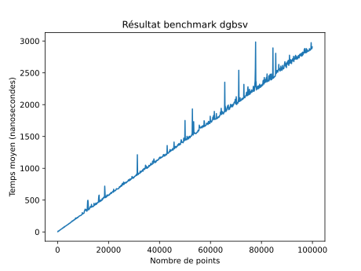
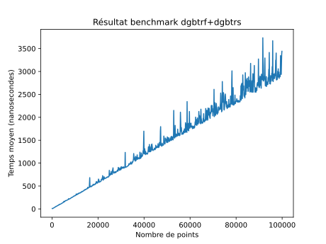
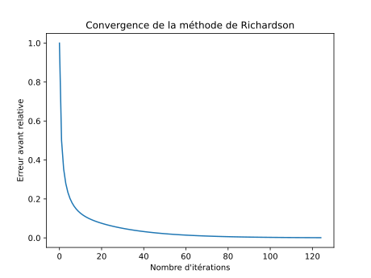
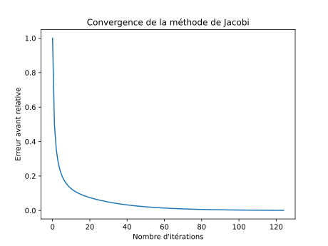
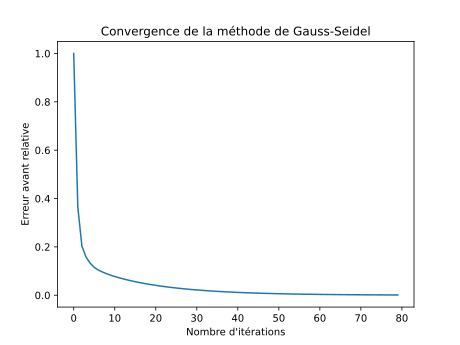

TODO: Ne pas oublier d'enlever ca
[TP_Poisson]$ docker build -t tppoisson -f docker/Dockerfile .
[TP_Poisson]$ docker run -it -v $PWD:/tp tppoisson
root@container:/app# cd /tp

# 2 Méthodes directe et stockage bande

### Exercice 3: Référence et utilisation de BLAS/LAPACK

Q1. En C, comment doit on déclarer et allouer une matrice pour utiliser BLAS et LAPACK?

R1. Exemple pour une matrice 3x2:
```c
double a[3][2] = {{1, 2}, {3, 4}, {5, 6}};
double* b = (double*)malloc(3*2*sizeof(double));
```

Q2. Quelle est la signification de la constante LAPACK_COL_MAJOR ?

R2. LAPACK_COL_MAJOR est une constante à passer en argument à certaines fonctions lapack pour indiquer que nos matrices sont stockées en colonne.
C'est à dire que tous les éléments d'une colonne sont stockés de manière contiguë en mémoire, et que les colonnes sont stockées les unes à la suite des autres.

Comme les matrices sont stockées en 1D dans le code, la matrice 2D m[2][2] = {1,2,3,4} sera traitée comme
$$
\begin{bmatrix}
	1 & 3 \\
	2 & 4 \\
\end{bmatrix}
$$
en LAPACK_COL_MAJOR et
$$
\begin{bmatrix}
	1 & 2 \\
	3 & 4 \\
\end{bmatrix}
$$
en LAPACK_ROW_MAJOR.

Q3. A quoi correspond la dimension principale (leading dimension) généralement notée ld ?

R3. La dimension principale correspond au nombre de lignes de la matrice en LAPACK_COL_MAJOR et au nombre de colonnes en LAPACK_ROW_MAJOR.
    C'est à dire le nombres d'éléments entre deux éléments consécutifs de la même ligne (en LAPACK_COL_MAJOR) ou de la même colonne (en LAPACK_ROW_MAJOR).

Q4. Que fait la fonction dgbmv ? Quelle méthode implémente-t-elle ?

R4. DGBMV = Double General Band Matrix Vector multiplication.  
Avec A une matrice bande, x et y des vecteurs, alpha et beta des scalaires, elle calcule : $$alpha*A*x + beta*y$$ou $$alpha*A^T*x + beta*y$$ selon l'argument transpose.  

D'abord elle commence par calculer ```y = beta*y``` séquentiellement, en séparant des cas optimisés.
- Si beta = 0, alors y = 0
- Si beta = 1, alors on ne fait rien
- Sinon, on multiplie chaque élément de y par beta

On peut aussi spécifier de multiplier seulement les n éléments de y, avec l'argument incy, et dans ce cas on a aussi 2 cas optimisés pour incy = 1 et incy != 1.  
Cette optimisation semble inutile, car en C cela reviendrai à différencier les cas  
```for (int i = 0; i < n; i++) {}```  
```for (int i = 0; i < n; i += incy) {}```.  
Mais cela est sûrement dû au fait que le code a été écrit il y a longtemps, et que les compilateurs n'étaient pas aussi optimisés qu'aujourd'hui.

Ensuite, elle calcule le produit matrice-vecteur colonne par colonne, en calculant l'index de début de la colonne dans la matrice A, et en multipliant chaque élément de la colonne par le vecteur x, et en ajoutant le résultat à y avec l'opération triadique ```y(i) = y(i) + x(i)*A(i,j)```.  
La fonction est optimisée pour les matrices diagonales, et la boucle la plus interne ne fait que ku + kl + 1 itérations, où ku et kl sont les nombres de diagonales au dessus et en dessous de la diagonale principale.
Cette fonction sépare les cas pour les incréments de x et y, et pour la transposition de A qu'elle fait à la volée en inversant les indices d'accès à A pour ne pas avoir à stocker A^T en mémoire.

Q5. Que fait la fonction dgbtrf ? Quelle méthode implémente-t-elle ?

R5. DGBTRF = Double General Band matrix TRiangular Factorisation.
Elle effectue la factorisation LU d'une matrice bande A, en stockant les facteurs L et U dans la matrice A.  
Elle utilise la méthode de Gauss avec pivot partiel, et stocke les pivots dans le vecteur ipiv.
Elle utilise le format de stockage de matrice bande, mais nécessite un peu plus de place pour stocker L et U, et donc la matrice A doit être carrée, et les dimensions de A doivent être égales.

Q6. Que fait la fonction dgbtrs ? Quelle méthode implémente-t-elle ?

R6. DGBTRS = Double General Band matrix TRiangular Solve.  
Elle résout un système linéaire A*x=b avec une matrice bande
La matrice A doit avoir été factorisée avec dgbtrf, et est donc sa décomposition LU.
Elle résout le système linéaire en 2 étapes:
- Résolution du système linéaire L*y=b avec y=U\*x.
- Résolution du système linéaire U*x=y avec U la matrice triangulaire supérieure de la décomposition LU de A.
Elle utilise la méthode de substitution avant et arrière pour résoudre le système linéaire, avec les méthodes de remontée et de descente, et nécessite le vecteur ipiv de la factorisation LU de A.

Q7. Que fait la fonction dgbsv ? Quelle méthode implémente-t-elle ?

R7. DGBSV = Double General Band matrix Solve.  
Cette fonction résout un système linéaire Ax=b avec une matrice bande.
Elle effectue la factorisation LU de la matrice bande et résout le système linéaire en une seule fonction.


Q8. Comment calculer la norme du résidu avec des appels BLAS?

R8. Déjà, rappelons les formules des différentes erreurs, avec x le vecteur solution exact, $\hat{x}$ le vecteur solution approximée, b le vecteur de droite, A la matrice du système linéaire, et r le résidu:

Formule du résidu:
$$r = b - A\hat{x}$$

Erreur relative arrière:
$$ relres = \frac{||b - A\hat{x}||}{||A||||\hat{x}||}$$

Erreur relative avant:
$$ relres = \frac{||r||}{||b||} = \frac{||b - A\hat{x}||}{||b||} $$
Dans notre cas, on connait le x solution exact, donc on peut utiliser la formule suivante:
$$ relres = \frac{||x - \hat{x}||}{||x||} $$

Dans ce TP on utilise l'erreur avant comme résidu, et on connait notre x exact, donc on va utiliser 
$$ r = \frac{||x - \hat{x}||}{||x||} $$

Pseudo-code:
```scilab
// xex est le vecteur exact
// xappr est le vecteur approximé

// Numérateur
a = ddot(&n, xex, 1, xex, 1) // Somme des carrés des éléments de xex
a = sqrt(a) // Norme de xex

// Dénominateur
b = daxpy(&n, -1, xex, 1, xappr, 1) // xex contient xex - xappr
b = ddot(&n, b, 1, b, 1) // Somme des carrés des éléments de xex - xappr
b = sqrt(b) // Norme de xex - xappr

// Résultat
r = b/a
```
Les signatures des fonctions cblas sont identiques, donc le code C sera très similaire.

### Exercice 4: Stockage GB et appel à DGBMV

1. Ecrire le stockage GB en priorité colonne pour la matrice de Poisson 1D.
$$
\begin{bmatrix}
    	2 & -1 & 0 & 0 \\
    	-1 & 2 & -1 & 0 &  ...\\
    	0 & -1 & 2 & -1 \\
	0 & 0 & -1 & 2 \\
	& & ⁝

\end{bmatrix}
$$

Transformation en General Band Storage:
On a 3 éléments par colonne avec kv padding de lignes de zéros.
$$
\begin{bmatrix}
	0 & 0 & 0 & 0 & ... & 0 \\
	⁝ & kv & lignes & de & zéros & ⁝\\
	0 & 0 & 0 & 0 & ... & 0\\
	0 & -1 & -1 & ...& -1 & -1 \\
	2 & 2 & 2 & ... &2 & 2 \\
	-1 & -1 & -1 &  ... & -1 & 0 \\
\end{bmatrix}
$$

Avec priorité colonne : 
```c
A = {/*kv zéros*/, 0, 2, -1, 
	/*kv zéros*/, -1, 2, -1,
	/*kv zéros*/, -1, 2, -1,
	..., 
	/*kv zéros*/, -1, 2, 0};
```

3. Proposez une méthode de validation.

On peut valider notre stockage en multipliant la matrice stockée à chaque vecteur unitaire en utilisant dgbmv comme
```c
// On suppose A et x déjà initialisés, et y déjà alloué
double y[n];
int incx = 1;
int incy = 1;
double alpha = 1;
double beta = 0;
cblas_dgbmv(CblasColMajor, CblasNoTrans, n, n, kv, kv, alpha, A, n, x, incx, beta, y, incy);
// y contient maintenant le résultat de A*x
```
Et normalement on doit obtenir le vecteur colonne correspondant à la colonne de la matrice stockée.
$$
\begin{bmatrix}
	2 & -1 & 0 & 0 \\
	-1 & 2 & -1 & 0 \\
	0 & -1 & 2 & -1 \\
	0 & 0 & -1 & 2 \\
\end{bmatrix}
\begin{bmatrix}
	1 \\
	0 \\
	0 \\
	0 \\
\end{bmatrix}
=
\begin{bmatrix}
	2 \\
	-1 \\
	0 \\
	0 \\
\end{bmatrix}
$$

On peut aussi multiplier A par le vecteur [1, 1, ..1.., 1] et vérifier que le résultat est [1, 0, 0, ..0.., 0, 1], car cela revient à sommer les colonnes de A, et -1 + 2 - 1 = 0, à part pour les premières et dernières colonnes qui ont un -1 en moins.
$$
\begin{bmatrix}
	2 & -1 & 0 & 0 \\
	-1 & 2 & -1 & 0 \\
	0 & -1 & 2 & -1 \\
	0 & 0 & -1 & 2 \\
\end{bmatrix}
\begin{bmatrix}
	1 \\
	1 \\
	1 \\
	1 \\
\end{bmatrix}
=
\begin{bmatrix}
	1 \\
	0 \\
	0 \\
	1 \\
\end{bmatrix}
$$

Et aussi multiplier par la matrice identité pour vérifier que le résultat est bien la même matrice.
$$
\begin{bmatrix}
	2 & -1 & 0 & 0 \\
	-1 & 2 & -1 & 0 \\
	0 & -1 & 2 & -1 \\
	0 & 0 & -1 & 2 \\
\end{bmatrix}
\begin{bmatrix}
	1 & 0 & 0 & 0 \\
	0 & 1 & 0 & 0 \\
	0 & 0 & 1 & 0 \\
	0 & 0 & 0 & 1 \\
\end{bmatrix}
=
\begin{bmatrix}
	2 & -1 & 0 & 0 \\
	-1 & 2 & -1 & 0 \\
	0 & -1 & 2 & -1 \\
	0 & 0 & -1 & 2 \\
\end{bmatrix}
$$

### Exercice 5: DGBTRF, DGBTRS, DGBSV

Q2. Évaluer les performances. Que dire de la complexité des méthodes appelées?




On peut voir que les deux fonctions ont des performances similaires.
Et malgré le bruit on peut remarquer qu'elles ont toutes les deux une complexité linéaire en fonction du nombre de points.

Ce qui est attendu car la matrice est tri-diagonale, et donc la factorisation LU est en O(n) et la résolution du système est en O(n), car chaque colonne de la matrice ne possède que 3 éléments non nuls, et donc chaque étape de la factorisation LU et de la résolution du système ne nécessite que 3 opérations au maximum au lieu de n opérations pour une matrice pleine.

### Exercice 6: LU pour les matrices tri-diagonales

Q2. Proposez une méthode de validation pour l'implémentation de la factorisation LU pour une matrice tri-diagonale stockée en format General Band.

R2. On peut valider notre implémentation de la factorisation LU en multipliant la matrice L et U, que nous devons extraire car elles sont fusionées dans la matrice A après l'appel, et en vérifiant que le résultat est bien la matrice originale, car par définition de la factorisation LU, A = LU.  
En plus, on peut utiliser des tests unitaires avec d'autres méthodes de factorisation LU sur les matrices générales pour vérifier que notre implémentation est correcte.
Par exemple,
$$
\begin{bmatrix}
	2 & -1 & 0 \\
	-1 & 2 & -1 \\
	0 & -1 & 2 \\
\end{bmatrix}
$$
doit être factorisée en
$$
L = \begin{bmatrix}
	1 & 0 & 0 \\
	-0.5 & 1 & 0 \\
	0 & -0.66... & 1 \\
\end{bmatrix}
U = \begin{bmatrix}
	2 & -1 & 0 \\
	0 & 1.5 & -1 \\
	0 & 0 & 1.33 \\
\end{bmatrix}
$$

# 3 Méthode de resolution itérative

### Exercice 7: Implémentation C - Richardson

Q3. Analyser la convergence, tracez l'historique de la convergence.

R3.




### Exercice 8: Implémentation C - Jacobi

On a A =
$$
\begin{bmatrix}
	2 & -1 & 0 & 0 \\
	-1 & 2 & -1 & 0 \\
	0 & -1 & 2 & -1 \\
	0 & 0 & -1 & 2 \\
\end{bmatrix}
$$

On la sépare en D, L et U:
$$
D = \begin{bmatrix}
	2 & 0 & 0 & 0 \\
	0 & 2 & 0 & 0 \\
	0 & 0 & 2 & 0 \\
	0 & 0 & 0 & 2 \\
\end{bmatrix}
L = \begin{bmatrix}
	0 & 0 & 0 & 0 \\
	-1 & 0 & 0 & 0 \\
	0 & -1 & 0 & 0 \\
	0 & 0 & -1 & 0 \\
\end{bmatrix}
U = \begin{bmatrix}
	0 & -1 & 0 & 0 \\
	0 & 0 & -1 & 0 \\
	0 & 0 & 0 & -1 \\
	0 & 0 & 0 & 0 \\
\end{bmatrix}
$$

La matrice d'itération de Jacobi est: (cf cours)
$$
M = D^{-1} = \begin{bmatrix}
	0.5 & 0 & 0 & 0 \\
	0 & 0.5 & 0 & 0 \\
	0 & 0 & 0.5 & 0 \\
	0 & 0 & 0 & 0.5 \\
\end{bmatrix}
$$

On peut voir que la matrice d'itération de Jacobi est une matrice diagonale, et donc stockable en format General Band.

On peut aussi remarquer que cette matrice revient au même résultat que de faire richardson avec un alpha = 0.5, car M = D^{-1} = 0.5 * I.



On a exactement la même convergence que pour Richardson avec un alpha = 0.5, ce qui confirme que ces deux méthodes sont équivalentes.

### Exercice 9: Implémentation C - Gauss-Seidel

On a A = 
$$
\begin{bmatrix}
	2 & -1 & 0 & 0 \\
	-1 & 2 & -1 & 0 \\
	0 & -1 & 2 & -1 \\
	0 & 0 & -1 & 2 \\
\end{bmatrix}
$$

On la sépare en D, L et U:
$$
D = \begin{bmatrix}
	2 & 0 & 0 & 0 \\
	0 & 2 & 0 & 0 \\
	0 & 0 & 2 & 0 \\
	0 & 0 & 0 & 2 \\
\end{bmatrix}
L = \begin{bmatrix}
	0 & 0 & 0 & 0 \\
	-1 & 0 & 0 & 0 \\
	0 & -1 & 0 & 0 \\
	0 & 0 & -1 & 0 \\
\end{bmatrix}
U = \begin{bmatrix}
	0 & -1 & 0 & 0 \\
	0 & 0 & -1 & 0 \\
	0 & 0 & 0 & -1 \\
	0 & 0 & 0 & 0 \\
\end{bmatrix}
$$

La matrice d'itération de Gauss-Seidel est:
$$
M = D - E = D + L = \begin{bmatrix}
	2 & 0 & 0 & 0 \\
	-1 & 2 & 0 & 0 \\
	0 & -1 & 2 & 0 \\
	0 & 0 & -1 & 2 \\
\end{bmatrix}
$$

On inverse M pour obtenir la matrice d'itération de Gauss-Seidel:
$$
M^{-1} = \begin{bmatrix}
	0.5 & 0 & 0 & 0 \\
	0.25 & 0.5 & 0 & 0 \\
	0.125 & 0.25 & 0.5 & 0 \\
	0.0625 & 0.125 & 0.25 & 0.5 \\
\end{bmatrix}
$$

On peut voir un pattern dans les coefficients de la matrice d'itération de Gauss-Seidel, en effet, chaque coefficient est la moitié du coefficient au dessus, et le premier coefficient est 0.5 à la diagonale principale.
Cela est cohérent avec la méthode de Gauss-Seidel, car on fait la moyenne des valeurs des voisins pour obtenir la valeur de la cellule courante, et à chaque itération on fait la moyenne des valeurs des voisins de la valeur précédente, et donc on divise par 2 à chaque itération.

Cependant, pour avoir une matrice tri-diagonale, nous allons devoir tronquer la matrice d'itération de Gauss-Seidel, car elle est triangulaire inférieure.
Nous nous retrouvons avec une matrice M^{-1} un peu moins précise, mais qui est tri-diagonale:
$$
M^{-1} = \begin{bmatrix}
	0.5 & 0 & 0 & 0 \\
	0.25 & 0.5 & 0 & 0 \\
	0 & 0.25 & 0.5 & 0 \\
	0 & 0 & 0.25 & 0.5 \\
\end{bmatrix}
$$

